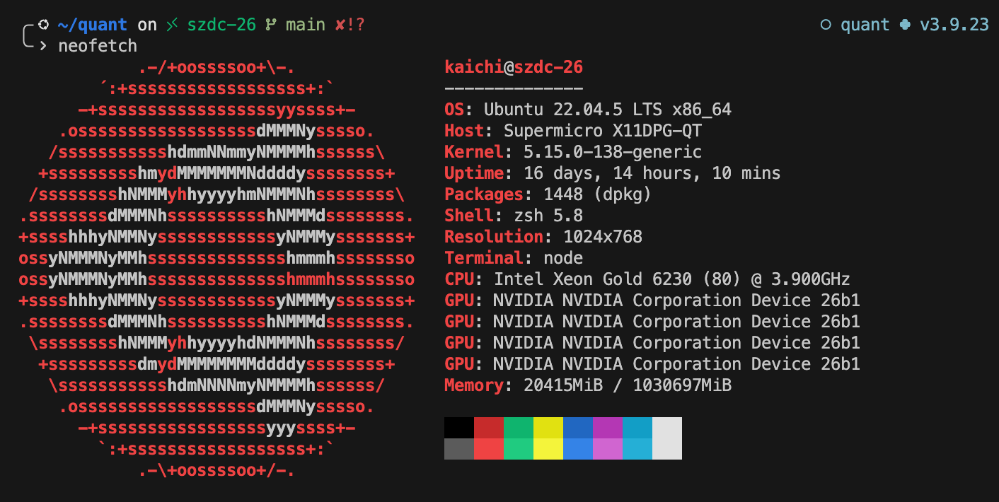

# 终端配置指南

> 针对非root用户的终端环境配置，使用 Zsh + Starship 打造现代化的命令行体验

## 🚀 安装步骤

### 1. 🔧 安装 Zsh

使用[第三方脚本](https://github.com/romkatv/zsh-bin)安装 Zsh，非root用户请选择安装路径为 `~/.local`。安装过程中当提示将 zsh 加入 PATH 时，选择 "quit and do nothing"（我们将在后续步骤中手动配置）。

**执行安装命令：**
```bash
sh -c "$(curl -fsSL https://raw.githubusercontent.com/romkatv/zsh-bin/master/install)"
```

**配置自动启动：**

安装完成后，在原本的 `.bashrc` 中添加以下内容，这样会在打开 bash 时自动切换到 zsh：

```bash
export PATH=$PATH:$HOME/bin   # 添加PATH
export SHELL=`which zsh`      # 设置$SHELL为zsh
exec `which zsh` -l           # 设置登录为zsh
```

### 2. ⭐ 安装 Starship

**下载并安装：**
```bash
curl -sS https://starship.rs/install.sh | sh -b ~/.local 
```

- `-sS`：silent 和 show-error 模式，安静运行，只在出错时输出信息
- `-b ~/.local`：指定安装目录为 `~/.local`，避免使用 sudo 权限

**配置环境变量：**

将 Starship 添加到 PATH 中：
```bash
echo 'export PATH="$HOME/.local:$PATH"' >> ~/.zshrc
```

将 Starship 初始化脚本添加到 shell 配置文件中：
```bash
echo 'eval "$(starship init zsh)"' >> ~/.zshrc
```

**自定义配置：**

在 `~/.config` 目录下创建 `starship.toml` 文件，并将 [starship配置](starship.toml) 添加到该文件中。
```bash
cd ~/.config
touch starship.toml
```

### 3. 🐍 Conda 集成配置

**初始化 Conda 环境：**

在 zsh 下初始化 conda，执行以下命令：
```bash
conda init zsh
```

**禁用 Conda 默认提示：**

由于 Starship 已经显示 conda 环境信息，我们可以禁用 conda 自带的提示符，避免重复显示：
```bash
conda config --set changeps1 False
```

### 4. neofetch 配置（可选）
其实 [neofetch](https://github.com/dylanaraps/neofetch) 就是一个 bash 脚本，无需编译和复杂依赖，因此只需要下载到本地即可运行
```bash
# 1. 下载 neofetch 脚本到你自己的 bin 文件夹
mkdir -p ~/bin
curl -Lo ~/bin/neofetch https://raw.githubusercontent.com/dylanaraps/neofetch/master/neofetch
 
# 2. 赋予执行权限
chmod +x ~/bin/neofetch

# 3. 把 ~/bin 添加到 PATH（如果还没有的话）
echo 'export PATH="$HOME/bin:$PATH"' >> ~/.zshrc
source ~/.zshrc
```
